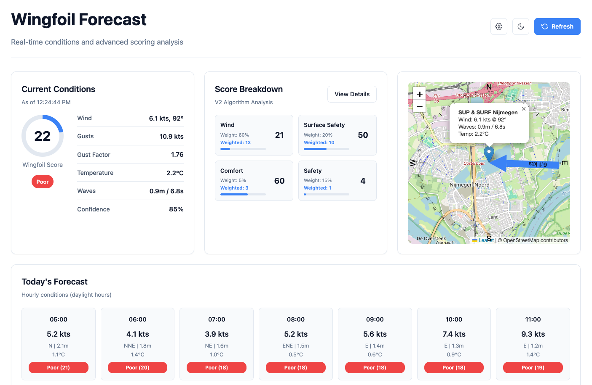

# Wingfoil Forecast

A weather and wingfoil-condition service that aggregates multiple weather models to deliver **wingfoil suitability scores**, equipment recommendations, and forecast APIs, built for clarity, accuracy, and easy deployment.

---

## What it does

- **Multi-model consensus**: Combines KNMI HARMONIE-AROME, DWD ICON-D2, ECMWF IFS, GFS, and OpenWeatherMap with weighted averaging and smart caching.
- **Wingfoil scoring (0–100)**: Suitability score with gust penalties, wind/shore alignment, and wave conditions; click-through breakdown of how each score is calculated.
- **Personalisation**: Wing size suggestions by rider weight, skill-level adjustments (beginner/intermediate/advanced), and configurable wind/wave thresholds.
- **Web dashboard & APIs**: Browser UI for current conditions and forecasts; REST APIs for integration (e.g. InkyPi, other clients).

---

## Why it’s useful

Generic weather apps don’t answer “is it good to go wingfoiling?” This service does: it turns raw marine and standard weather data into a single, interpretable score and equipment guidance, so you can decide quickly and safely. It’s built with Dutch/European spots in mind (with a default location) but works globally via the included models.

---

## Tech stack & architecture

- **Backend:** Python 3.11, **Flask** (Gunicorn in production).
- **Data:** Async/parallel fetching (**aiohttp**, **requests**), thread-safe in-memory cache with configurable TTL and max age.
- **Deployment:** **Docker** (multi-stage Dockerfile: dev with hot-reload, production with non-root user), **docker-compose** with Traefik labels, optional basic auth.
- **APIs:** REST endpoints for current conditions, hourly and multi-day forecasts, tomorrow summary, daily summary, and InkyPi-oriented morning report; config and health checks.

High-level flow: **Config** (location, shore direction, preferences) → **Weather fetchers** (per model) → **Cache** → **Consensus & scoring** → **Dashboard + JSON APIs**.

---

## Project structure (summary)

- `app/main.py`: Flask app, routes, caching, scoring, and model aggregation.
- `app/templates/`: Dashboard, settings, API help (HTML).
- `app/static/`: Static assets and overlay SVGs.
- `config/`: Config and example config (not committed).
- `docs/`: Internal docs and screenshots.
